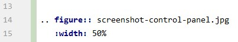

A simple header!
=====================

one asterisk: *text* for emphasis (italics),
two asterisks: **text** for strong emphasis (boldface), and
backquotes: ``text`` for code samples.

* This is a bulleted list.
* It has two items, the second
  item uses two lines.

asdf

1. This is a numbered list.
2. It has two items too.

asdf

#. This is a numbered list.
#. It has two items too.

Here is some text explaining some very complicated stuff.::

    print('hello')
    >> hello

.. warning:: Here be dragons! This topic covers a number of options that
   might alter your database.

   Proceed with caution!

   An overview of the admin control panel.

Python code:

.. code-block:: python
   :linenos:

   import antigravity

   def main():
       antigravity.fly()

.. _my-reference-label:

Section to cross-reference
--------------------------

This is the text of the section.

It refers to the section itself, see :ref:`my-reference-label`.

.. csv-table:: Frozen Delights!
   :header: "Treat", "Quantity", "Description"
   :widths: 15, 10, 30

   "Albatross", 2.99, "On a stick!"
   "Popcorn", 1.99, "Straight from the oven"

Guide
^^^^^

.. toctree::
   :maxdepth: 2

   license
   setup_and_run
   migrations
   js_assets
   js_override

Indices and tables
==================

* :ref:`genindex`
* :ref:`modindex`
* :ref:`search`
